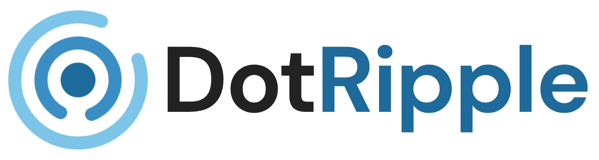

<p align="center">
  
</p>

<p align="center">
  <strong>Unleash Your Thoughts. Join the Ripple.</strong>
</p>

<p align="center">
  A modern, high-performance blogging and community discussion platform built for writers, creators, and thinkers to publish stories, connect with readers, and spark conversations.
</p>

---

## 🌟 Features

- **⚡ Real-time Publishing**: Instant updates and reactive queries powered by Convex.
- **💬 Dynamic & Secure Comments**: Engage with authors safely with robust server-side authentication and role-based comment moderation.
- **👤 Creator Spotlight**: Custom user profile cards showcasing bios, avatars, and linked social channels (GitHub, LinkedIn, Twitter/X, Instagram).
- **🎨 Premium Aesthetic**: A beautiful dark/light mode UI built with custom glassmorphism, responsive grids, and micro-interactions.
- **🔒 Secure Architecture**: Robust server-side authorization preventing spoofing (IDOR) and database integrity checks.

---

## 💻 Tech Stack

### Frontend

- **Core**: [Next.js](https://nextjs.org/)
- **Styling**: [Tailwind CSS](https://tailwindcss.com/)
- **Forms & Validation**: [React Hook Form](https://react-hook-form.com/) & [Zod](https://zod.dev/)
- **UI Components**: [Shadcn UI](https://ui.shadcn.com/)

### Backend

- **Database & API**: [Convex](https://convex.dev/)
- **Authentication**: [Better Auth](https://www.better-auth.com/)

---

## 🚀 Getting Started

Follow these steps to set up and run the project locally.

### Prerequisites

- Node.js (v18.x or later)
- pnpm (recommended), npm, or yarn

### 1. Install Dependencies

```bash
pnpm install
```

### 2. Start the Backend (Convex)

Convex handles your database and server-side endpoints. Run the following command to start the development database:

```bash
pnpm convex dev
```

_Note: This command will generate your `.env.local` file containing the `NEXT_PUBLIC_CONVEX_URL` automatically._

### 3. Run the Development Server

In another terminal window, start the Next.js development server:

```bash
pnpm dev
```

### 4. Open the App

Navigate to [http://localhost:3000](http://localhost:3000) in your browser to view the application.

---

## 🛡️ Security Measures

- **Server-side Authorization**: Session tokens are verified securely on the Convex backend for all mutative operations (creating/deleting comments, updating profiles).
- **Input Sanitization**: React automatically sanitizes all rendered variables (escaping HTML entities) to guard against XSS. Skema Zod ensures input format conformance.
